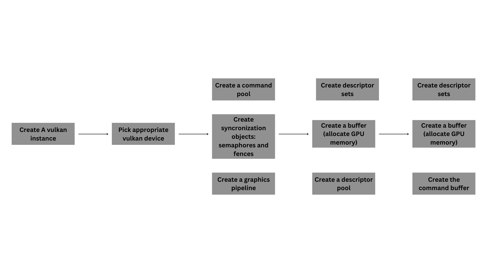
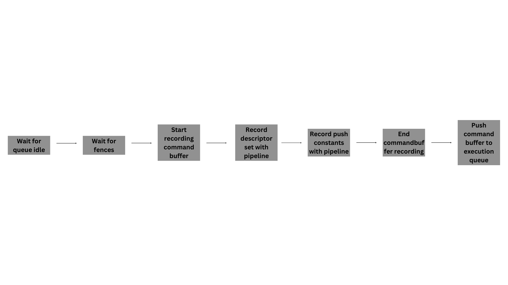
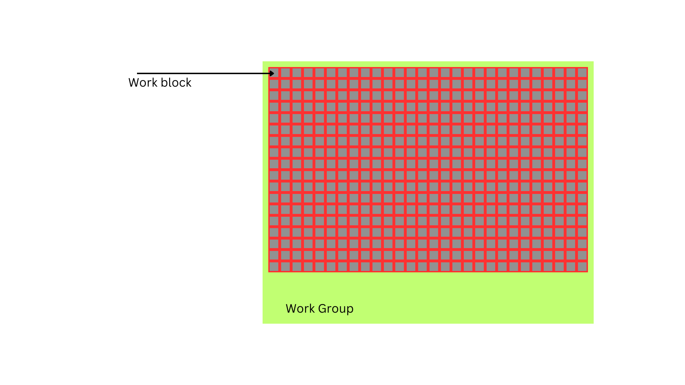
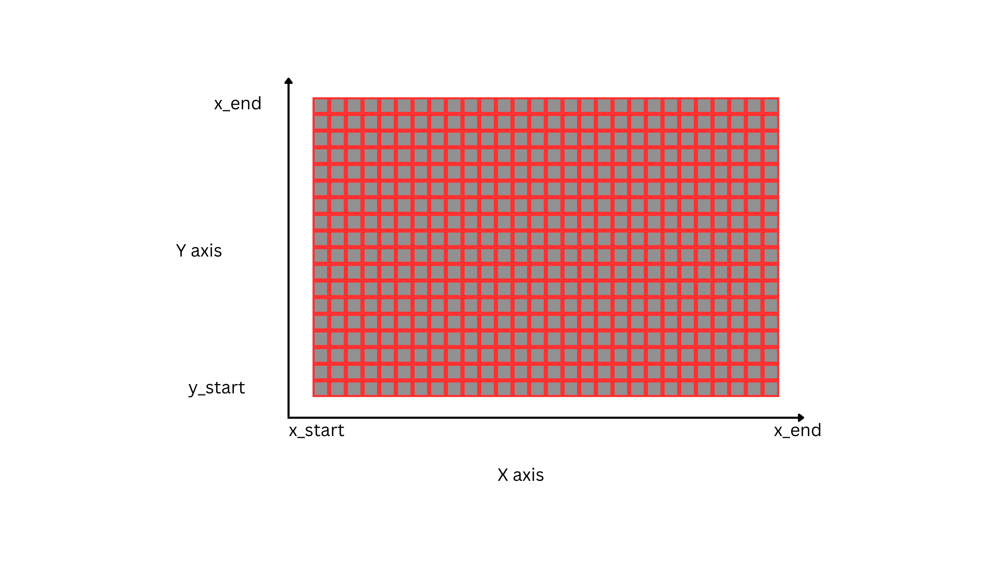
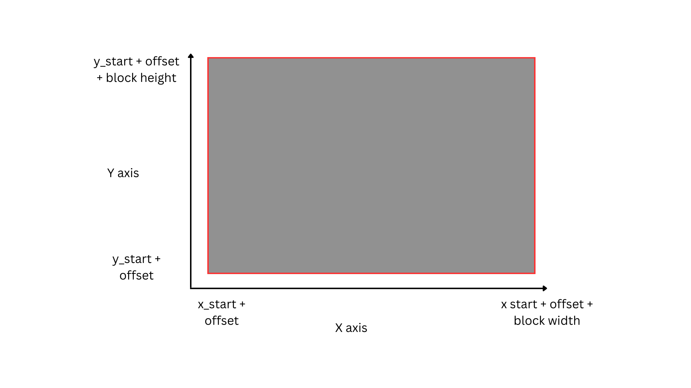
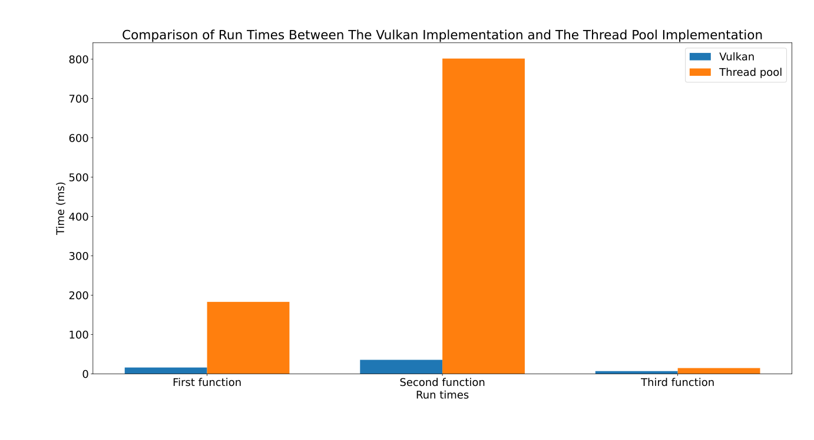
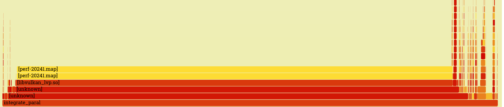

# Report for additional integrals lab: implementing integration on hterogenous procs

## Installation

### Vulkan
You will need vulkan tools and libvulkan. Here are the commands:

- `sudo apt install vulkan-tools` or `sudo dnf install vulkan-tools`: Command-line utilities
- `sudo apt install libvulkan-dev` or `sudo dnf install vulkan-loader-devel` : Installs Vulkan loader
- `sudo apt install vulkan-validationlayers-dev spirv-tools` or `sudo dnf install mesa-vulkan-devel vulkan-validation-layers-devel`

!!! On Arch Linux, you can run `sudo pacman -S vulkan-devel` to install all the required tools above. !!!

### Shaders
Two popular shader compilers are Khronos Group's glslangValidator and Google's glslc. 
The latter has a familiar GCC- and Clang-like usage, so we'll go with that: 
- On Ubuntu, download Google's [unofficial binaries](https://github.com/google/shaderc/blob/main/downloads.md)
    and copy glslc to your `/usr/local/bin`. Note you may need to sudo depending on your permissions. 
- On Fedora use `sudo dnf install glslc`, while on 
- On Arch Linux run sudo `pacman -S shaderc`. 

To test, run `glslc` and it should rightfully complain we didn't pass any shaders to compile:
```
glslc: error: no input files
```

## Project structure and architecture
This time, we used vulkan. The structure is entrirely different, lol.
It consists of these parts:
- A vulkan instance handler
- A vulkan device handler (it also handler queues families and submit queues)
- A vulkan command buffer handler
- A descriptor set handler
- A buffer handler (vulkan buffer = GPU memory + utils used with it)
- A **compute** pipeline handler
- Shaders for function calculation.

The whole program workflow works liek this:



And to use the created utils, we do:



Here, we provide some clarifications:
### Queue families 
Vulkan has four primary types of execution queues:
- Graphic queues
- Compute queues
- Present queues - ones used to draw images
- Transfer queues - they are used to move data between GPU and CPU

A queue family is just a name for this classification.
Vulkan pushes some intructions to the these queues with of
command buffers and pulls intructions from these queues,

### Command buffers
A command buffer is just an abstraciton for a container having data.
To create it, you first have to state which queue it belongs to,
and also have a command pool. A command pool is a utility for
creating command buffers.

### Descriptor set
A descriptor set is just the organization of data inside tha shader:
say, we have such a start in out shader:

```glsl
#version 450 core

layout(set = 0, binding = 0) buffer Output {
    double fn_results[];
};

........................................
........................................
........................................
```
The derscriptor set 0 would state that it has an array of doubles,
and have a pointer to the memory location of this array.

Vulkan uses the descriptor sets since it is very hard to infer what data
the shader would use correctly. It does provide a great advantage, however -
thanks to this architectural choice, we can use pointers on the GPU,
or even have arbitrarily sized arrays like here!

## Algorithm of threads calculation
The calculation is split into at most 256 compute blocks in a single work group.
Splitting it into more would be wasteful, since having a bigger work group would be
wasteful for most GPUs, at least according to vulkan best practices.

The split looks like this:






After splitting the data, we simply map GPU memory to CPU memory with vulkan
and sum the results.

## Performance
This implementation os waaaaaaayyyy faster than out fastest CPU implementation.
Our best implementation was the thread pool one, since we did not recreate threads on that one.
Still, here are the results of threadpool compared to vulkan ones:


## Perf results
To be honest, most of the heavy lifting is done in `libvulkan.so`, so not much
can be inferred from the flamegraphs. They just look like this:


I have triple checked if I have compiled on `RelWithDebInfo`, and still...
Pretty sad, but predictable.

Anyways, here's `perf stat:`
#### First function
```
Performance counter stats for './build/integrate_parallel_vulkan 1 config_files/func1.cfg':

         6,189,408      cache-references
         1,809,943      cache-misses                     #   29.24% of all cache refs
       474,000,893      cycles
       397,355,498      instructions                     #    0.84  insn per cycle
        40,316,603      branches
             6,408      faults
                23      migrations

       0.081042529 seconds time elapsed

       0.135625000 seconds user
       0.032121000 seconds sys
```

#### Second function
```
Performance counter stats for './build/integrate_parallel_vulkan 2 config_files/func2.cfg':

         5,636,827      cache-references
         1,709,823      cache-misses                     #   30.33% of all cache refs
       832,833,615      cycles
       980,054,099      instructions                     #    1.18  insn per cycle
        43,287,077      branches
             6,324      faults
                24      migrations

       0.098040095 seconds time elapsed

       0.261484000 seconds user
       0.036771000 seconds sys
```

#### Third function
```
Performance counter stats for './build/integrate_parallel_vulkan 3 config_files/func3.cfg':

         5,626,385      cache-references
         1,745,402      cache-misses                     #   31.02% of all cache refs
       257,263,963      cycles
       315,895,605      instructions                     #    1.23  insn per cycle
        37,485,133      branches
             6,384      faults
                21      migrations

       0.062690343 seconds time elapsed

       0.075592000 seconds user
       0.022232000 seconds sys

```


I'd say that there's a lot of cache misses, but that's logical - perf only looks at CPU workflow,
and most of the cache-friendly calculations are done on the GPU)
Everything that is done on the CPU is driver code and dynamic lib loading, so everythins is fair.


## Conclusions
I really like vulkan, even more than CUDA. Vulkan has clear separation of responsibilities -
if you want to allocate the memory for the GPU, you cant just `double *` your way to that.
It's very explicit, and though it makes it **veeeeeeryyy** verbose, I still like it.
I mean, I already have the templates from my raytracer, so it's like editing 500 lines of code, and
only because I had to switch to compute pipelines from graphical ones.

Another great thing is the validation layers. They are soooo great. It's like a dynamic code alayzer,
I really like them. They make vulkan really easy to debug.

The only regret I have is that I did not try the third-party vulkan memory allocation library,
I heard it's nice too.

As for the results, they are fairly evident, lol. 10x speedup on the first 2 functions and
2x speedup on the third one. Vulkan's fun!
